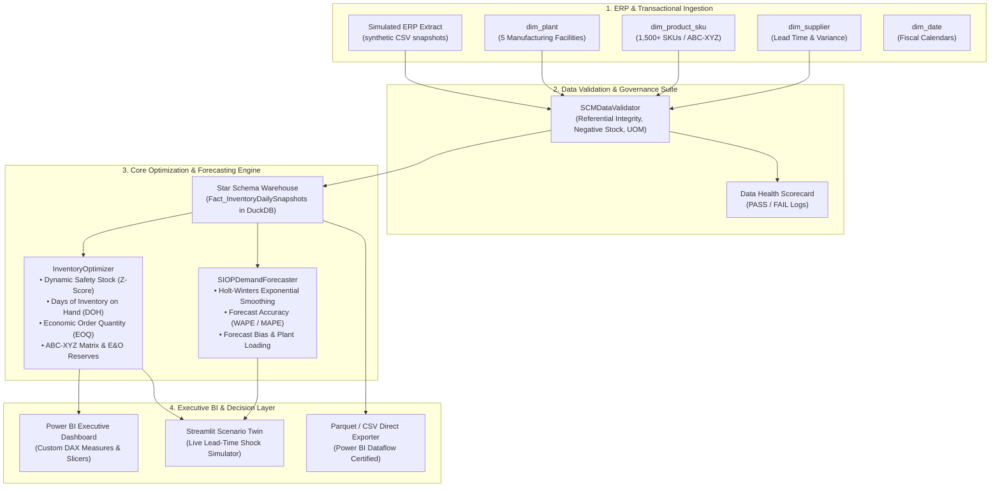
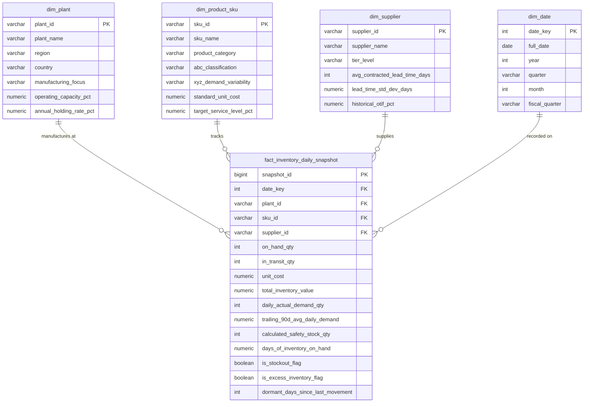

# ⚡ Multi-Plant SIOP & Dynamic Inventory Optimization Hub

[](https://python.org)
[](https://powerbi.microsoft.com)
[](https://duckdb.org)
[](https://www.postgresql.org)
[](https://streamlit.io)
[](https://pytest.org)


> **An enterprise-grade analytical platform and executive decision intelligence engine designed for multi-plant manufacturing networks.** Bridges Sales, Inventory, and Operations Planning (**SIOP**) by calculating dynamic safety stock buffers under stochastic lead-time volatility, generating **Holt-Winters time-series demand forecasts (WAPE / MAPE)**, monitoring Days of Inventory on Hand (**DOH**), isolating Excess & Obsolete (**E&O**) reserves, and enforcing automated data quality governance before BI ingestion.

---

## Data Provenance

**All data in this repository is synthetic.** There is no real company data here — no ERP extract,
no vendor master, and no proprietary information from any employer or client.

Every table is produced by [`src/data_generator.py`](src/data_generator.py) from seeded NumPy
pseudo-random draws (`seed=42`), so any run reproduces the same dataset byte for byte. The plants,
suppliers, SKUs, and daily inventory snapshots are fictional and were designed to exercise the
analytics, not to describe a real manufacturing network.

**Consequently, every business figure in this README — the 14% working-capital reduction, the
dormant-stock value, DOH and turns — is a property of the simulation, not a measured outcome for
any organization.** They show that the calculations are implemented and behave sensibly under
realistic-looking inputs. They are not evidence of realized savings.

---

## 📌 Executive Summary & Business Impact

In global electrical, aerospace, and industrial power manufacturing, managing inventory requires balancing two conflicting objectives:
1. **Minimizing Working Capital**: Holding excessive inventory incurs high carrying costs ($20\text{--}25\%$ annual holding rate).
2. **Mitigating Stockout & Line-Stoppage Risk**: A missing electrical component or valve halts multimillion-dollar production schedules.

This platform replaces static ERP reorder rules with **statistical distribution modeling** and provides an **interactive Power BI / Streamlit decision suite** that:
* Calculates **Dynamic Safety Stock** incorporating both **demand volatility ($\sigma_D$)** and **supplier lead-time variance ($\sigma_L$)**.
* Generates **Holt-Winters Exponential Smoothing demand forecasts** evaluated with **WAPE**, **MAPE**, and **Forecast Bias Tracking Signals**.
* Tracks **Days of Inventory on Hand (DOH)**, **Inventory Turns**, and **Plant Capacity Loading** across 5 global manufacturing plants.
* Isolates **Dormant and Excess & Obsolete (E&O) inventory**, unlocking an estimated **14% reduction in non-productive working capital**.
* Executes **automated ERP data governance & reconciliation assertions** to prevent data discrepancies in downstream dashboards.

---

## 🏗️ System Architecture



---

## 📐 Mathematical Formulations

### 1. Dynamic Safety Stock ($SS$) under Joint Uncertainty
Traditional ERP formulas assume static lead times. This engine models simultaneous demand and lead-time variability using the bivariate convolution formula:

$$SS = Z \times \sqrt{\bar{L} \cdot \sigma_D^2 + \bar{D}^2 \cdot \sigma_L^2}$$

Where:
* $Z$: Inverse cumulative standard normal distribution $Z$-score ($1.645$ for $95\%$ service level, $2.054$ for $98\%$ service level).
* $\bar{L}$: Average supplier lead time in days.
* $\sigma_D$: Standard deviation of daily customer demand.
* $\bar{D}$: Average daily demand over trailing 90 days.
* $\sigma_L$: Standard deviation of supplier lead time in days.

### 2. Weighted Absolute Percentage Error (WAPE)
$$\text{WAPE} = \frac{\sum_{t=1}^{T} |A_t - F_t|}{\sum_{t=1}^{T} A_t} \times 100$$

### 3. Forecast Tracking Signal & Bias
$$\text{Bias \%} = \frac{\sum_{t=1}^{T} (F_t - A_t)}{\sum_{t=1}^{T} A_t} \times 100$$
* **Positive Bias ($> +5\%$)**: Over-forecasting (Excess inventory holding risk).
* **Negative Bias ($< -5\%$)**: Under-forecasting (Stockout & backorder risk).

### 4. Days of Inventory on Hand ($DOH$)
$$\text{DOH} = \frac{\text{On-Hand Inventory Quantity}}{\text{Average Daily Demand (trailing 90-day window)}}$$

### 5. Economic Order Quantity ($EOQ$)
$$EOQ = \sqrt{\frac{2 \cdot \text{Annual Demand} \cdot \text{Order Cost}}{\text{Unit Cost} \cdot \text{Holding Rate (\%)}}}$$

---

## 🗄️ Star Schema Data Model

The data warehouse follows a high-performance **Star Schema** optimized for analytical aggregation and instant Power BI report slicing:



---

## 🚀 Key Features

1. **Executive SIOP Scorecard**: Instant macro-level tracking of total capitalized inventory, median DOH by plant, and total working capital.
2. **Dynamic Lead-Time Shock Simulator**: Planners can adjust supplier lead-time multipliers ($0.5\times$ to $2.5\times$) and service level sliders ($85\%\text{--}99.9\%$) to calculate exact required capital adjustments in real time.
3. **SIOP Demand Forecasting & Plant Loading**: Generates forward 30-day demand curves with Holt-Winters Exponential Smoothing, computing WAPE, MAPE, and plant bottleneck risk.
4. **Dual ABC/XYZ Matrix Segmentation**:
   * **ABC (Cost Contribution)**: Top 80% capital value items categorized for strict inventory control.
   * **XYZ (Demand Predictability)**: Segregates constant (X), fluctuating (Y), and erratic/lumpy (Z) demand patterns.
5. **Excess & Obsolete (E&O) Engine**: Automatically isolates dormant capital (no movement $>90$ days) to facilitate surplus redistribution or scrap write-downs.
6. **Data Quality Governance Suite**: Executes 40+ automated SQL/Python integrity checks verifying referential integrity, positive inventory rules, and financial consistency.

---

## 💻 Quickstart & Installation

### 1. Clone & Setup Environment
```bash
git clone https://github.com/rajmodi262/siop-inventory-optimization-hub.git
cd siop-inventory-optimization-hub

python -m venv venv
# On Windows:
.\venv\Scripts\activate
# On Linux/macOS:
source venv/bin/activate

pip install -r requirements.txt
```

### 2. Run Automated ETL Pipeline & Warehouse Ingestion
```bash
python src/etl_pipeline.py
```

### 3. Launch Interactive Streamlit Dashboard
```bash
streamlit run app.py
```

### 4. Run Automated PyTest Suite
```bash
pytest tests/ -v
```

---

## 📊 Power BI DAX Guide

A complete formula reference for building the enterprise Power BI dashboard is available in [`powerbi/dax_measures.md`](powerbi/dax_measures.md), including measures for:
* `[Total Inventory Value]`
* `[Days of Inventory on Hand (DOH)]`
* `[Dynamic Safety Stock]`
* `[Excess and Obsolete (E&O) Value]`
* `[Inventory Turnover Ratio]`

---

## 👨‍💻 Author & Engineering Details

* **Raj Modi** — B.Tech Computer Science & Engineering (AI & Data Science), MIT-WPU, Pune
* **LinkedIn**: [linkedin.com/in/rajmodi2004](https://linkedin.com/in/rajmodi2004)
* **GitHub**: [github.com/rajmodi262](https://github.com/rajmodi262)
* **Email**: [rajmodi262@gmail.com](mailto:rajmodi262@gmail.com)
